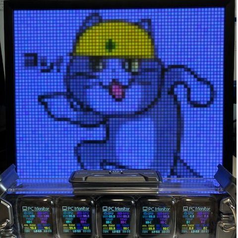

# Divoom client tool for Pixoo-64



# Install

```
dotnet tool install -g DivoomTool
```

# Usage

## Service

| Command | Pixoo64 | Times Gate | Description |
|:-|:-:|:-:|:-|
| device | ✅ | ✅ | Get LAN device list |
| font | ✅ | ✅ | Get supported font list |


```
divoom device
```

```
divoom font
```

## Channel

| Command | Pixoo64 | Times Gate | Description |
|:-|:-:|:-:|:-|
| current | ✅ | ✅ | Get current channel |
| channel | ✅ | | Set channel type |
| lcd5 list | | ✅ | Get lcd whole list |
| lcd5 info | | ✅ | Get lcd independence information |
| lcd5 channel | | ✅ | Set channel type |
| lcd5 whole | | ✅ | Select whole clock |
| clock type | ✅ | ✅ | Get clock type |
| clock list | ✅ | ✅ | Get clock list |
| clock info | ✅ | | Show clock information |
| clock select | ✅ | ✅ | Select clock |
| cloud select | ✅ | | Select cloud page |
| equalizer select | ✅ | ✅ | Select equalizer |
| custom select | ✅ | | Select custom page |
| monitor select | ✅ | ✅ | Select monitor |
| monitor update | ✅ | ✅ | Update monitor |

```
divoom current -h 192.168.1.101
```

```
divoom channel -h 192.168.1.101 -t clock
divoom channel -h 192.168.1.101 -t cloud
divoom channel -h 192.168.1.101 -t equalizer
divoom channel -h 192.168.1.101 -t custom
```

```
divoom lcd5 list -p 1
```

```
divoom lcd5 info
```

```
divoom lcd5 info -d 300000000
```

```
divoom lcd5 channel -h 192.168.1.102 -t w
divoom lcd5 channel -h 192.168.1.102 -t i -l 400000
```

```
divoom lcd5 whole -h 192.168.1.102 -c 581
```

```
divoom clock type
```

```
divoom clock list -t Game -p 1
divoom clock list -t Game -l -p 1
```

```
divoom clock info -h 192.168.1.101
```

```
divoom clock select -h 192.168.1.101 -c 625
divoom clock select -h 192.168.1.102 -c 625 -l 400000 -i 3
```

```
divoom cloud select -h 192.168.1.101 -p 3
```

```
divoom equalizer select -h 192.168.1.101 -p 5
```

```
divoom custom select -h 192.168.1.101 -p 1
```

```
divoom monitor select -h 192.168.1.101
```

```
divoom monitor update -h 192.168.1.101 -d "50 %,10 %,60 C,35 C,40 %,45 C"
```

## Tool

| Command | Pixoo64 | Times Gate | Description |
|:-|:-:|:-:|:-|
| timer | ✅ | ✅ | Timer tool |
| watch | ✅ | ✅ | Stopwatch tool |
| score | ✅ | ✅ | Scoreboard tool |
| noise | ✅ | ✅ | Noise status tool |

```
dovoom timer start -h 192.168.1.101 -s 30
dovoom timer stop -h 192.168.1.101
```

```
dovoom watch start -h 192.168.1.102
dovoom watch stop -h 192.168.1.102
dovoom watch reset -h 192.168.1.102
```

```
dovoom score -h 192.168.1.101 -r 123 -b 456
```

```
dovoom noise start -h 192.168.1.101
dovoom noise stop -h 192.168.1.101
```

## Image/Text

| Command | Pixoo64 | Times Gate | Description |
|:-|:-:|:-:|:-|
| image reset | ✅ | | Reset image id |
| image id | ✅ | | Get image id |
| image draw | ✅ | | Draw image |
| image fill | ✅ | | Fill image |
| remote list | ✅ | ✅ | List upload images |
| remote like | ✅ | ✅ | List like images |
| remote draw | ✅ | ✅ | Draw remote image |
| text draw | ✅ | | Draw text |
| text clear | ✅ | | Clear text |
| display | ✅ | | Display item list |
| gif play | ✅ | | Play gif image |
| gif array | | ✅ | Play gif array |
| gif all | | ✅ | Play gif all lcd |

```
divoom image reset -h 192.168.1.101
```

```
divoom image id -h 192.168.1.101
```

```
divoom image draw -f safety_meme_cat.png -h 192.168.1.101
```

```
divoom image fill -h 192.168.1.101 -c #808080
```

```
divoom remote list -d 300000000 -m ffffffffffff
```

```
divoom remote like -d 300000000 -m ffffffffffff
```

```
divoom remote draw -h 192.168.1.101 -i group1/M00/0A/DC/rBAAM2e2-eKEfxlMAAAAAAGACoI8283236
divoom remote draw -h 192.168.1.102 -i group1/M00/0A/DC/rBAAM2e2-eKEfxlMAAAAAAGACoI8283236 -a 01010
```

```
divoom text draw -h 192.168.1.101 -i 1 -x 0 -y 0 -w 32 -f 2 -c #FF0000 -t test
```

```
divoom text clear -h 192.168.1.101
```

```
divoom display -h 192.168.1.101 -f items.json
```

```json
[
  {
    "TextId": 1,
    "Type": "HourMinuteSecond",
    "X": 0,
    "Y": 0,
    "Width": 64,
    "Height": 16,
    "Font": 42,
    "Color": "#7777FF",
    "Alignment": "Left"
  },
  {
    "TextId": 2,
    "Type": "Text",
    "X": 0,
    "Y": 16,
    "Width": 64,
    "Height": 16,
    "Font": 26,
    "Color": "#FF7777",
    "Text": "HELLO WORLD!!",
    "Alignment": "Middle"
  },
  {
    "TextId": 3,
    "Type": "Text",
    "X": 0,
    "Y": 32,
    "Width": 64,
    "Height": 16,
    "Font": 2,
    "Color": "#77FF77",
    "Text": "テキスト漢字",
    "Alignment": "Middle"
  }
]
```

```
divoom gif play -h 192.168.1.101 -t net -n http://f.divoom-gz.com/64_64.gif
```

```
divoom gif array -h 192.168.1.102 -a 10001 -u http://f.divoom-gz.com/64_64.gif
```

```
divoom gif all -h 192.168.100.1 -l1 http://f.divoom-gz.com/ISII.gif,http://f.divoom-gz.com/Kirby.gif -l2 http://f.divoom-gz.com/sr.gif,http://f.divoom-gz.com/loz.gif -l3 http://f.divoom-gz.com/lttp.gif,http://f.divoom-gz.com/lttpm.gif -l4 http://f.divoom-gz.com/SM2.gif,http://f.divoom-gz.com/SM3.gif -l5 http://f.divoom-gz.com/smk.gif,http://f.divoom-gz.com/smw.gif
```

## System

| Command | Pixoo64 | Times Gate | Description |
|:-|:-:|:-:|:-|
| buzzer | ✅ | ✅ | Play buzzer |
| rgb | | ✅ | Set rgb mode |

```
divoom buzzer -h 192.168.1.101 -a 500 -f 500 -t 3000
```

```
divoom rgb -h 192.168.1.102 -b 100 -c #FF0000 -l on -k on -y on -i all -e 0
```

## Other

See help.

# Reference

https://docin.divoom-gz.com/web/#/5/23
